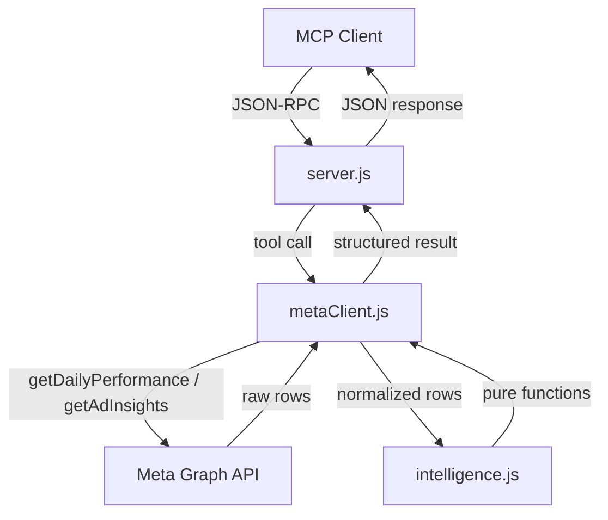

# Design Document: Creative Intelligence Engine

## Overview

The Creative Intelligence Engine extends the Meta Ads MCP server with three analytical tools that operate on top of the data already returned by existing API calls. No new Meta API endpoints are required. All analytical logic is implemented as pure functions in a new `src/intelligence.js` module, keeping it fully testable without network access. The three tools are:

- `detect_anomalies` — rolling-window anomaly detection with root-cause classification
- `generate_creative_brief` — data-driven creative brief generation from top-performing ads
- `get_spend_pacing` — month-to-date spend pacing and cash-flow projection

---

## Architecture



The data flow is identical to existing tools: `server.js` routes the call, `metaClient.js` fetches and normalizes data, `intelligence.js` performs all computation. No new npm dependencies are introduced — all math uses native JavaScript.

---

## Components and Interfaces

### `src/intelligence.js` (new)

All exports are pure functions. No imports from `metaClient.js` or `config.js`.

```js
// Anomaly detection
export function detectAnomalies(rows, options) → { anomalies, summary }

// Creative brief
export function selectTopAds(rows, topN) → AdSummary[]
export function inferHookType(adName) → string
export function buildCreativeBrief(topAds, brandContext) → CreativeBrief

// Spend pacing
export function computeSpendPacing(rows, options) → PacingResult
```

### `src/metaClient.js` (extended)

Three new async methods added to `MetaAdsClient`:

```js
async detectAnomalies(input)       → calls getDailyPerformance(), passes rows to intelligence.detectAnomalies()
async generateCreativeBrief(input) → calls getAdInsights(), passes rows to intelligence.selectTopAds() + buildCreativeBrief()
async getSpendPacing(input)        → calls getDailyPerformance(), passes rows to intelligence.computeSpendPacing()
```

### `src/server.js` (extended)

Three new tool registrations added to the `tools` array and three new entries in `toolHandlers`.

---

## Data Models

### Anomaly entry

```js
{
  metric: string,           // e.g. "cpm"
  baseline_avg: number,
  recent_avg: number,
  change_pct: number,       // (recent - baseline) / baseline
  root_cause: string,       // one of 7 enum values
  plain_english_explanation: string,
  recommended_action: string,
  severity: "low" | "medium" | "high"
}
```

Root-cause enum: `auction_pressure`, `creative_fatigue`, `tracking_break`, `learning_phase_reset`, `audience_saturation`, `offer_mismatch`, `budget_pacing`.

Severity thresholds: `|change_pct| >= 0.5` → `high`; `>= 0.3` → `medium`; else `low`.

### detectAnomalies options

```js
{
  anomaly_threshold: number,        // default 0.2
  monthly_budget: number | null,
  minimum_spend_to_judge: number    // default 1500
}
```

### AdSummary

```js
{
  ad_id: string,
  ad_name: string,
  ctr: number | null,
  roas: number | null,
  cost_per_purchase: number | null,
  spend: number,
  purchases: number | null,
  hook_type: string
}
```

### CreativeBrief

```js
{
  winning_ads: AdSummary[],
  winning_pattern: string,
  brief: [
    {
      hook: string,
      format: string,
      angle: string,
      copy_direction: string,
      visual_direction: string
    }
    // × 3
  ],
  meta_specs: {
    primary_text_max_chars: 125,
    headline_max_chars: 40,
    description_max_chars: 30,
    supported_formats: ["single_image", "carousel", "video", "collection"]
  },
  skill_context: {
    skills: ["ad-creative", "100m-offers"],
    instruction: string
  },
  production_checklist: string[]
}
```

### PacingResult

```js
{
  pacing_status: "on_track" | "overpacing" | "underpacing" | "at_risk",
  projected_month_spend: number,
  budget_remaining: number,
  days_remaining: number,
  avg_daily_spend: number,
  recommended_daily_budget: number,
  projected_profit_loss: number | null,
  breakeven_roas: number,
  cash_flow_warning: string | null
}
```

---

## Correctness Properties

*A property is a characteristic or behavior that should hold true across all valid executions of a system — essentially, a formal statement about what the system should do. Properties serve as the bridge between human-readable specifications and machine-verifiable correctness guarantees.*

### Property 1: Anomaly threshold monotonicity

*For any* set of daily performance rows, lowering `anomaly_threshold` should never produce fewer anomalies than a higher threshold applied to the same rows.

**Validates: Requirements 2.4**

---

### Property 2: Baseline/recent split is exhaustive and non-overlapping

*For any* array of N rows (N ≥ 4), the Baseline_Period and Recent_Period produced by the windowing function together contain exactly N rows with no row appearing in both halves.

**Validates: Requirements 1.4**

---

### Property 3: change_pct formula identity

*For any* baseline average B > 0 and recent average R, `change_pct = (R - B) / B` implies `recent_avg = baseline_avg × (1 + change_pct)`.

**Validates: Requirements 2.3**

---

### Property 4: Severity classification covers all change_pct values

*For any* anomaly with a computed `change_pct`, the `severity` field is always one of `"low"`, `"medium"`, or `"high"` — never null or undefined.

**Validates: Requirements 3.8**

---

### Property 5: Root-cause signals are mutually independent

*For any* window of rows, each of the 7 root-cause categories is evaluated independently; the presence of one root cause does not suppress detection of another.

**Validates: Requirements 3.10**

---

### Property 6: top_n cap

*For any* call to `selectTopAds` with `topN > 10`, the returned array length is at most 10.

**Validates: Requirements 5.4**

---

### Property 7: Top ads are sorted by ROAS descending

*For any* set of ad rows with distinct ROAS values, `selectTopAds` returns them in descending ROAS order.

**Validates: Requirements 5.2**

---

### Property 8: Brief always contains exactly 3 variation directions

*For any* valid input to `buildCreativeBrief`, the returned `brief` array has length exactly 3.

**Validates: Requirements 6.3**

---

### Property 9: Pacing projection identity

*For any* pacing computation where `days_remaining > 0`, `projected_month_spend = avg_daily_spend × (days_elapsed + days_remaining)`.

**Validates: Requirements 8.3**

---

### Property 10: budget_remaining invariant

*For any* pacing computation, `budget_remaining = monthly_budget - spend_to_date`.

**Validates: Requirements 8.4**

---

### Property 11: recommended_daily_budget identity

*For any* pacing computation where `days_remaining > 0`, `recommended_daily_budget = budget_remaining / days_remaining`.

**Validates: Requirements 8.5**

---

### Property 12: breakeven_roas identity

*For any* `gross_margin_pct` in (0, 1], `breakeven_roas = 1 / gross_margin_pct`.

**Validates: Requirements 8.9**

---

### Property 13: at_risk when overspent

*For any* pacing computation where `spend_to_date > monthly_budget`, `pacing_status` is `"at_risk"`.

**Validates: Requirements 8.7**

---

### Property 14: cash_flow_warning is null when on_track or underpacing

*For any* pacing result where `pacing_status` is `"on_track"` or `"underpacing"`, `cash_flow_warning` is `null`.

**Validates: Requirements 8.10**

---

## Error Handling

All error returns follow the existing `toolError(type, message, retryable, metaCode)` pattern from `metaClient.js`.

| Condition | Error type | Retryable |
|---|---|---|
| Fewer than 4 daily rows | `invalid_input` | false |
| No ads meet minimum spend | `invalid_input` | false |
| No scoping param for brief | `invalid_input` | false |
| `monthly_budget` missing or ≤ 0 | `invalid_input` | false |
| `gross_margin_pct` outside (0, 1] | `invalid_input` | false |
| Meta API network failure | `network_error` | true |
| Meta API auth failure | `auth_error` | false |

Input validation for `monthly_budget` and `gross_margin_pct` happens in `metaClient.js` before calling the Intelligence_Module, consistent with how existing methods validate `level` and `time_range`.

---

## Testing Strategy

### Unit tests (`src/intelligence.test.js`)

Unit tests cover specific examples and edge cases for every exported function:

- `detectAnomalies`: empty rows, fewer than 4 rows, zero baseline metric, each of the 7 root-cause signal patterns, threshold boundary values, severity boundary values.
- `selectTopAds`: topN capping at 10, ROAS sort order, minimum spend filtering.
- `inferHookType`: each recognized keyword, unrecognized name → `unknown`.
- `buildCreativeBrief`: output shape (3 variations, required fields present), brand_context incorporation.
- `computeSpendPacing`: days_remaining = 0 edge case, at_risk when overspent, each pacing_status branch, breakeven_roas formula, cash_flow_warning null/non-null.

Target: >80% line coverage of `intelligence.js`.

### Property-based tests

Jest's `test.each` with generated input arrays is used to implement property-based style tests without adding a new dependency. Each property from the Correctness Properties section maps to one test.

Property test tag format: `// Feature: creative-intelligence-engine, Property N: <property_text>`

Each property test runs across at minimum 20 generated input variants to exercise the universal quantification.

### No new dependencies

The existing Jest setup (`cross-env NODE_OPTIONS=--experimental-vm-modules jest --runInBand`) runs `intelligence.test.js` automatically because Jest discovers all `*.test.js` files. No `jest.config.js` changes are needed.
